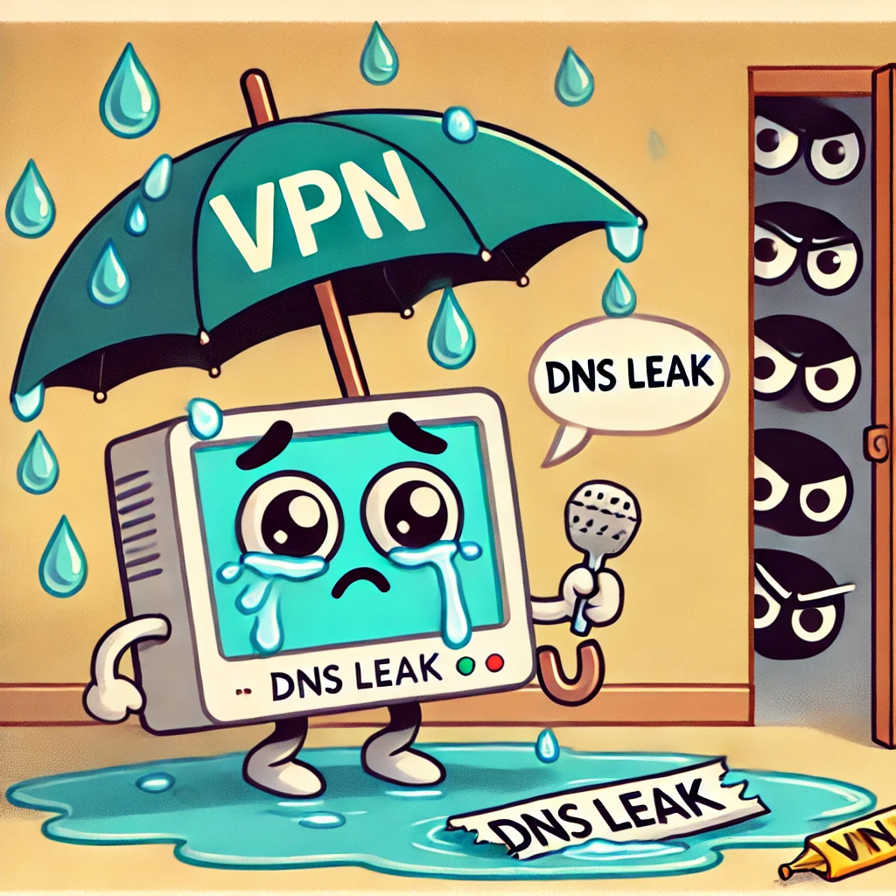
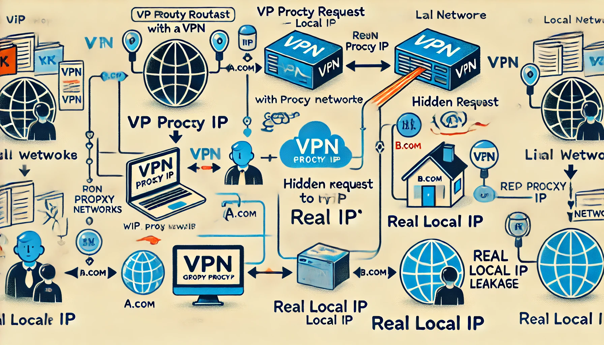

---

# 背景

很多人害怕通过某些手段找到自己的肉身，或者自己的网络行为被发现，说到底，其实是对现行网络安全的不信任，担心自己受到监控；在初期网络时代，对于电信运营商来说，用户的浏览内容完全可见，毫无隐私可言。随着 HTTPS 的普及（但是还是不能架住流氓，参考 [cnnic 事件](https://pao-pao.net/article/403)），浏览内容不能被看到了，**但是浏览记录还可能会被监控着**。

本文介绍在技术上如何防止自己的身份泄露，对于`社工攻击`（主动发言暴露身份的）暂且不涉及。而且本文的解决方案最先进和安全的。

## 本机 IP 泄露

当我们用 VPN 翻墙时，有两个 IP，一个是本机国内的真实 IP，一个是 VPN 代理服务器的 IP。正常来说，使用 VPN 时，无论访问什么网站，网站方收到的 IP，始终是代理服务器的 IP。

### 通过域名分流检测 IP 泄露

但是因为我们想要用路由分流，来提高访问速度，也就是“国内网站用本机真实的 IP，国外网站用 VPN 的代理 IP”。实际上，我们根本无法精确的区分哪个网站是属于中国大陆的，哪个网站不属于中国大陆，然而还是有好心人，整理维护一些数据库，用于区分不同类型的网站。参考 [Geosite](https://github.com/Loyalsoldier/v2ray-rules-dat)。

一些网站可以利用 Geosite 的精确度很低的缺点来获取用户的真实 IP，比如说：用户需要访问 `A.com` ，`A.com` 在 Geosite 中属于非中国网站，用户在访问 `A.com` 时，故意在他的网页内隐蔽地对 `B.com` 发起一次请求，然而 `B.com` 在 Goesite 里面属于中国大陆网站，从而 `B.com` 使用了真实的 IP，导致了真实 IP 泄露。

### 通过 UDP 检测 IP 泄露

还有一种就是通过请求非 HTTP 协议（例如说 WebRTC），探测用户的真实 IP。因为我们常用的 HTTP 代理协议，只能用于代理 TCP，无法代理 UDP，也就是 UDP 永远只能使用真实的用户 IP，从而导致真实 IP 泄露。

**解决 IP 泄露，唯一有效的解决方法就是：使用具有代理 UDP 功能的透明代理，并且不要使用路由分流功能。**

## DNS 泄露

什么是 DNS 泄露？当我们访问 google.com 时，必须要先进行 `域名解析`，从而获取目的服务器的 IP，然后才能打开谷歌，当我们发起 DNS 请求时，也必须要把我们想要的域名发送给 DNS 服务器；DNS 服务器必须要看到域名明文才能把目标服务器的 IP 发还给我们。

### 由 DNS 运营商泄露

有一些服从政府安排的 DNS 运营商，例如说阿里云（223.5.5.5）、腾讯云（1.12.12.12）等，你把域名发给他们解析，他们会记录下来，然后就可以随时上报你所访问的域名。

**解决 DNS 运营商泄露只能用自己信任的 DNS 提供商**，也有部分的会选择自建 DNS 服务器，但成本太高，而且有点技术难度。

所以有的人会信任国外的 DNS 提供商，例如说谷歌（8.8.8.8）、Cloudflare（1.1.1.1） 等提供的 DNS 服务器，但是通常他们都是在国外，所以访问速度堪忧。

### 中间人挟持的 DNS 泄露

假如说你想使用处于国外的谷歌 DNS 服务器： [udp://8.8.8.8 ](https://www.google.com) ，这种 udp 方式的 DNS 是最常见最悠久的方式。

但是这种 DNS 请求是没加密的，也就是说，中间人可以拦截并解析出你想访问的域名，更有甚者，直接挟持返回错误的 IP，在远古的网络时代，运营商经常通过此方法往我们的电脑“弹”广告，许多人苦不堪言。

同时，用 DNS 来阻止用户访问境外网站是 GFW 封锁的最主要手段。

不过幸运的是，业界很早就认识到，没有加密的 DNS 是很邪恶且危险的事情。带有加密的 DNS 服务器，例如说 [https://8.8.8.8 ](https://www.google.com)，已经很常见了。

**解决中间人挟持泄露必须使用带加密的 DNS 服务器**，也就是前缀为 `https` 和 `tls` 的那种。

### 解决 DNS 泄露的最佳方案

有些事情非常有趣：国外带加密的 DNS 服务器（例如说 https://8.8.8.8） 都是被 GFW 屏蔽的，也就是无论你怎么弄，都是无法使用的；反而不带加密的国外 DNS 服务器却是可以正常使用的，例如说： udp://8.8.8.8。

所以，我们必须要清楚地认识到，使用国外 DNS 提供商并不能解决问题，无论何时都必须要带加密的。

那问题来了：既然不能使用带有加密的国外 DNS 服务器，那不是说废话吗？别担心，UIF 已经你设置好了远程（国外）DNS 是默认走代理的，只要你有可用的翻墙节点，那么就可用，如果你没有翻墙节点，可以试试 [免费的翻墙节点](http://ui4freedom.org/UIF_help/blog/free_proxy_nodes)。

UIF 还提供了用 IP 来提高分流的精确度，在 [自定义路由](http://ui4freedom.org/#/route/my) 中可以看到 `IP 分流` 选项：

| 类型              | 区别                                    | 好处               | 坏处                 |
| ----------------- | --------------------------------------- | ------------------ | -------------------- |
| 不使用            | 就是不使用                              | 简单               | 过于简单，分流效果差 |
| 本地 DNS          | 每次访问时，都会用本地的 DNS 做域名解析 | 效果最好，速度最快 | DNS会泄露            |
| 带 ECS 的远程 DNS | 每次访问时，都会用远程的 DNS 做域名解析 | 最安全             | 延迟高               |

`带 ECS 的远程 DNS` 还需要可用翻墙节点；CDN 地区选择可能会稍差，取决于 DNS 提供商，仅谷歌等极少量提供商支持。具体使用哪一种，根据自己的需求选择即可。UIF 默认`不使用`。
