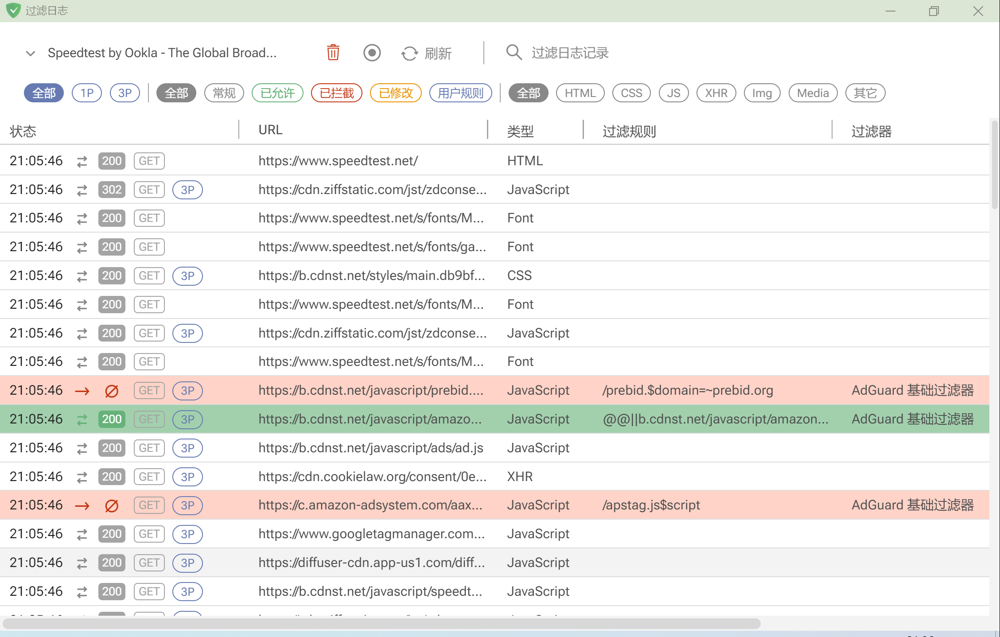
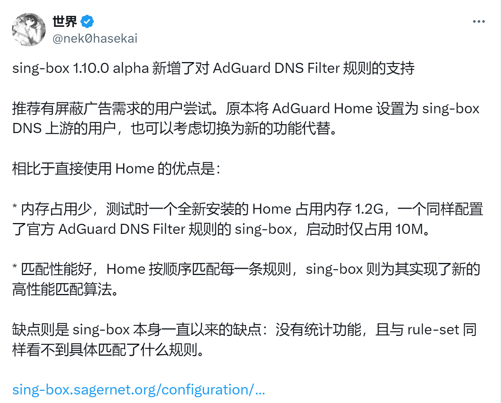
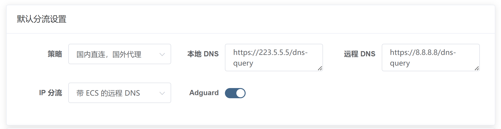

import Tabs from '@theme/Tabs';
import TabItem from '@theme/TabItem';

首先我们要知道技术上是如何屏蔽广告的？当访问一个网页时，广告也会随着网页内容一同显示在浏览器上，要屏蔽某一个网页上的广告，就必须得区分出真实内容和广告内容。所以总的来说，屏蔽广告的方法分为俩大类：

## 非侵入式

屏蔽广告程序不会去检查传输的内容，仅知道传输的域名和 IP。

比如说谷歌有专门的广告域名 `ad.google.com`，当我们检测到存在该域名的链接，就把他中断掉，从而无法显示出来。然而，如果某个网站的广告域名是 `user.x.com`，用户的信息也会通过此域名传输，即使我们知道这个会传输广告，但是屏蔽了他，也就同样屏蔽了正常的功能。

即使可能会误杀，但还是有好心人收集整理了这些广告域名数据库，例如说 [domain-list-community](https://github.com/v2fly/domain-list-community)

支持这种屏蔽方式的软件有：

- clash
- v2ray/xray
- [sing-box](https://sing-box.sagernet.org/zh/)

以上的软件的原理基本上都是接管所有网络流量，然后分析识别，匹配目标域名是否在广告数据库中，如果在，那么就中断。而且他们所依赖的数据库基本上都是 [domain-list-community](https://github.com/v2fly/domain-list-community)，效果可以说是大同小异。

同时也存在能屏蔽广告的 DNS，例如说 AdGuard DNS，只要把你的设备的 DNS 设置成他们的就可以屏蔽广告。原理还是一样的：通过域名匹配广告数据库。但是这些 DNS 都在国外，延迟非常高，基本不可用，所以就有 [AdGuardHome](https://github.com/AdguardTeam/AdGuardHome)，允许你本地搭建一个 DNS Server。

## 侵入式

这种方式效果最好，我们会获得传输的所有内容，更加细化和精确。但也是同样依赖数据库更新的。

支持这种方式的基本只有浏览器插件，例如说：

- [ADBlock](https://getadblock.com/zh_CN/)
- AdGuard

图中所展示的就是 AdGuard 的移除广告效果，因为，这类插件都是寄生在浏览器身上，本来就能获取网页内所有的内容，所以能区分广告内容还是有效内容，做到精确移除网页内的广告。

但如果你是用通过 App 使用 YouTube 之类的，你是无法安装并使用这些插件的。想要屏蔽 App 的广告是不现实的，我们首先需要做中间人 [MITM 解密](https://zh.wikipedia.org/wiki/%E4%B8%AD%E9%97%B4%E4%BA%BA%E6%94%BB%E5%87%BB) 传输内容，即使能获取传输内容，我们也需要花费大量精力研究如何修改这些传输内容，不同于广告数据库，修改这些内容有可能需要复杂的编程。

如果一个 APP，直接内嵌证书，而不使用系统内的证书，那么连解密的机会都没有了，只能去破解 APP。市面上也有许多非官方版的破解 APP，但非常不建议去使用这些来源不明的 APP，可能会留有后门。

## 最佳方案

维护广告数据库是十分困难的，全球几千万站点，每天上百亿次广告展现，频繁变更的广告植入方式。

当然了，最佳方案就是给 APP 钱，开会员去广告。但如果你不想给钱，可以尝试一下：使用 AdGuard 规则的 sing-box；原理跟 Clash、V2ray 之类是一样的，但使用了 [更加完善的广告数据库](https://github.com/ppfeufer/adguard-filter-list)，更新更加频繁，生态更好。

如果你是浏览器用户，那么直接使用插件即可。

通常在软路由上，人们都喜欢去安装 AdGuardHome，使用 Sing-Box 的具体优势参考上图。**在 UIF 中，你仅需点击启用即可使用 AdGuard 的广告过滤**，全系统支持 WIndows、Linux、Macos 当然也包括软路由。

:::warning
在 UIF 中启用了 `AdGuard` 功能，试试打开 [analytics.google.com](https://analytics.google.com/analytics/web) 这是谷歌的广告管理工具，可以发现打不开被误杀了。这属于正常现象。
:::
