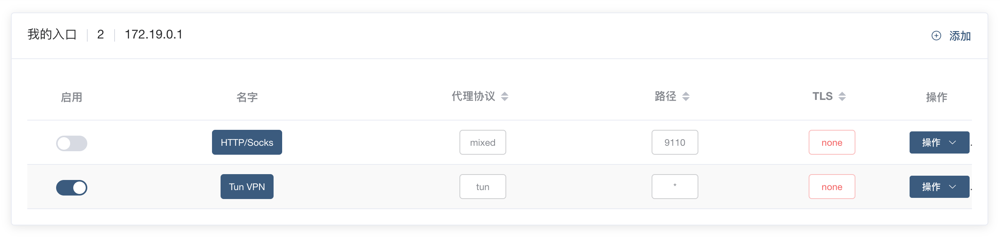
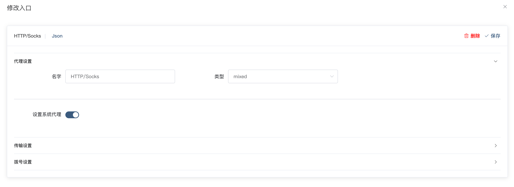
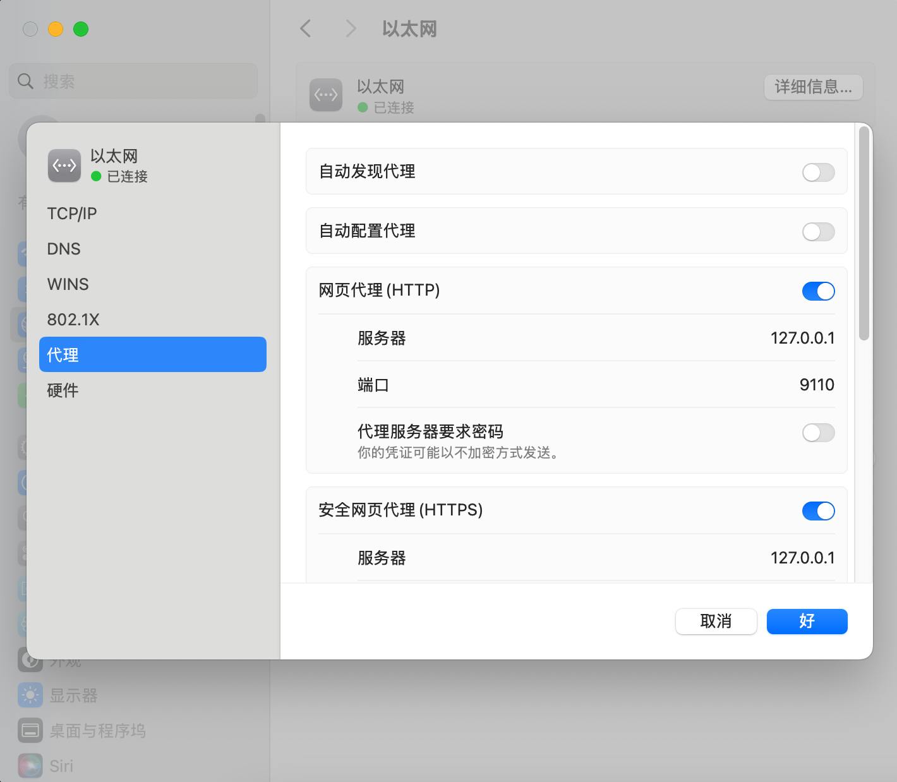

有了翻墙的服务器节点后，还需要让代理软件接管电脑的网络流量，然后才能将你的流量转发到翻墙节点，从而实现翻墙。

本文介绍两种常用接管流量的方法：`HTTP/Socks` 和 `Tun VPN`，并总结优点和缺点，选择适合自己的方法。



## HTTP/Socks

如果你使用的是 Windows 操作系统，并且平时只是看看网页，刷刷视频的，启用这个入站最合适你。

### 实现原理

当你在用浏览器访问 Google.com 时，一般来说浏览器会先检查你操作系统中是否设置了 `系统代理`，如果使用了，那么就会将请求先发送到 `系统代理` 所提供的地址，例如说：`127.0.0.1:9110`，这个地址就是由 UIF 提供的，所以 UIF 就能获取你想访问的网站，从而转发翻墙。

### 优缺点

- **要软件的支持**；浏览器检不检查，转不转发并不是强制的，全看软件愿不愿意支持
- **侵入性小，性能较好**；随启随用，无负担
- **适用性有限，无法代理 UDP 流量**；所以也就适合看看网页

### 如何使用？

#### ① Windows 和 Mac 用户

仅需在 UIF 入站中点击 `启用按钮` 即可。UIF 会把操作系统中的系统代理设置为 UIF 所提供的地址。

#### ② 有图形化界面的 Linux 用户

由于发行版较多，无法做到统一适配，一般来说都是支持一键设置系统代理的，例如说 Ubuntu 操作系统。但如果出现 `initialize system proxy: unsupported desktop environment` 就意味着不支持自动设置。那就需要 [自行设置](#自行设置操作系统的系统代理)。

#### ③ 没有图形化界面的 Linux 用户 和 Docker 用户

无法做到一键设置，是绝对会出现 `initialize system proxy: unsupported desktop environment` 的，从而导致内核无法运行（就是显示 `未运行` 状态）。

**_如何解决 `initialize system proxy: unsupported desktop environment` ?_**

出现这个错误的意思就是：UIF 无法自行设置系统代理，你需要手动去设置。去到 HTTP 的入站设置，如下图所示：


取消启用 `设置系统代理`，然后点击右上角 `保存` 即可解决问题。

### 自行设置操作系统的系统代理

不需要 UIF 帮你设置系统代理，或者UIF 无法自动帮你设置系统代理，那么就需要你自己手动去操作。

一般而言，Windows 和 Mac 都可以在图形化界面一键启用或关闭系统代理：



所以只需讨论 Linux 是如何操作的，具体情况参考[文章](https://www.joxrays.com/linux-system-proxy/)。简单来说，你需要自行执行两条命令即可：

```bash
export http_proxy=http://127.0.0.1:9110
export https_proxy=http://127.0.0.1:9110
```

9110 是 UIF 默认 HTTP 入站的端口，你可以在入站列表里自行去查看或修改监听的端口。

如果你想在局域网内的用户都可以使用你所提供的代理服务，你仅需将监听地址改为公网，并开放防火墙，这样就可以让其他人也使用你的代理。

## Tun VPN

如果你做软件开发或者需要游戏加速等复杂情景，Tun 能最大限度的满足所有的需求。

然而 Tun 的实现方式比较复杂，而且必须需要管理员权限（Root）。具体的请看 [透明代理](https://ui4freedom.org/UIF_help/docs/inbound/tun) 。
