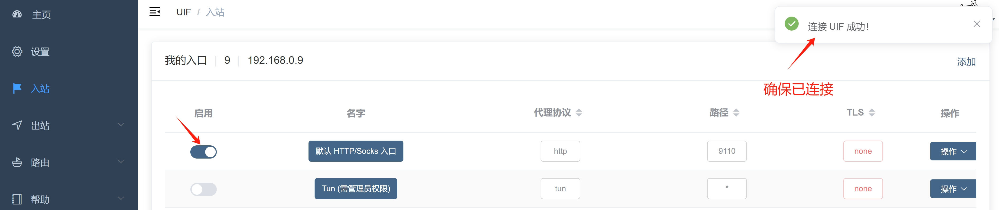
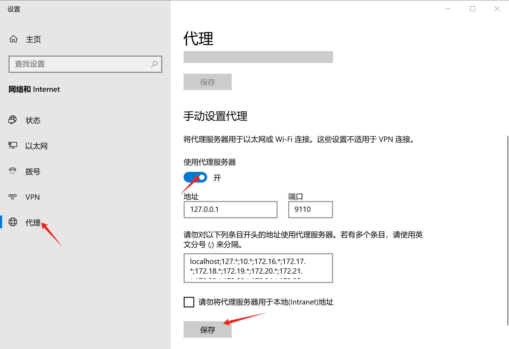
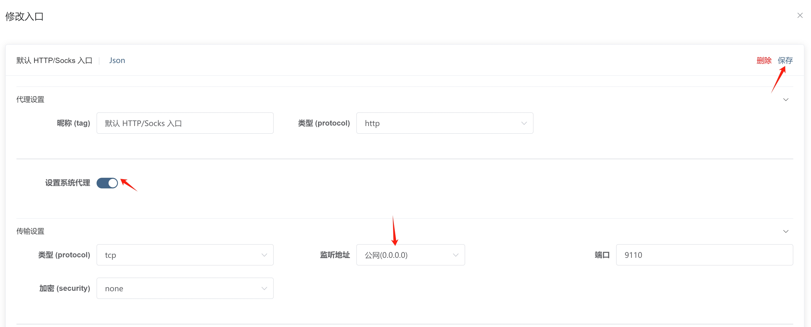

# HTTP 方式

这种方式适合大部分的用户，例如说：平常只需看看油管、推特、做外贸、聊天等。

:::tip
在 Linux（没有图形界面的） 或 Docker 中，若要使用 HTTP，需在入站配置中 不启用 `设置系统代理`，然后自行手动去设置系统的 HTTP 代理，否则会无法自动配置系统的系统代理而导致内核无法启动。
:::

## 开启/关闭

到 [入站页面](https://uiforfreedom.github.io/#/in/my)，选择 `默认 HTTP/Socks 入口` 点击 `启用` 即可开启或关闭。

## 设置操作系统的代理

UIF 虽然开启了 HTTP，但是需要你的操作系统设置成 UIF 的 HTTP 入口；

如果你启用了 HTTP 方式，UIF 会默认自动帮你设置好系统代理。

如果你不想 UIF 帮你设置代理，到 [入站页面](https://uiforfreedom.github.io/#/in/my)；选择 `默认 HTTP/Socks 入口` 点击 `详情` -> `代理设置` -> `设置系统代理`，即可决定是否自动设置你本机的系统代理。

## 局域网可用

假如你手机、平板，连上家里的 WiFi 也可以使用 HTTP 代理，可以点击 `详情` -> `代理设置` -> `地址`，将地址改为 `0.0.0.0` 意味着此地址是对外开放的。

同时你需要检查一下你本机的防火墙，需要运行外部流量允许通过你的防火墙。

