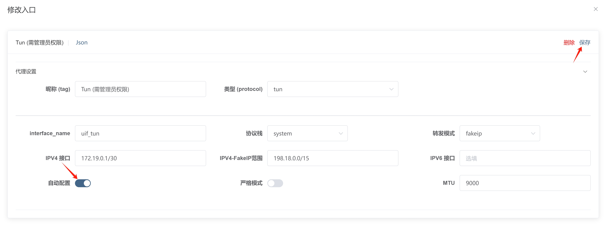

import TunAndRoute from './tun_and_route.mp4';
import ReactPlayer from 'react-player'

# Tun (透明代理) 方式

** 本文 4K 高清视频已上传到 [Youtube](https://www.youtube.com/watch?v=7TeRvFJAi1A)**

<ReactPlayer controls url={TunAndRoute}  width="100%" height="100%" />

---

什么是透明代理？简单来说，代理程序会建立一个虚拟（假的）网卡，让系统所有流量都自动转发到假的网卡上，这些流量都是原始的流量，程序必须解码还原成需要的代理流量，最后转发翻墙。

所以该方式侵入式很强，且开启时需要管理员权限，不建议非程序员使用。不过好处就是适用性广，功能强大，但是并不是说启用就会加速或减少延迟什么的。

:::tip
使用 Tun 网卡需要管理员权限。目前 UIF 支持 Windows 和 Linux 自动启动并提权（全自动）
:::

## 开启/关闭

**在 Windows、Macos 中因为要提权，未启用时都需要重启 UIF：**

- 当打开运行 UIF 时，[UIF 入站](http://ui4freedom.org/#/in/my) 中的 `Tun VPN` 并未启用。你需要先到 [入站页面](https://uiforfreedom.github.io/#/in/my)，选择 `Tun` 点击 `启用`，然后右上角选择 `关闭 UIF`，也就是说必须重启 `uif` 才能生效；

- 当打开运行 UIF 时，[UIF 入站](http://ui4freedom.org/#/in/my) 中的 `Tun VPN` 已经启用了。正常来说，已经自动提权并开了 Tun。此时无需再重启。

- macOS 使用 Tun 时建议把 interface_name 留空，不然的话容易起冲突

## 自动配置系统路由表

内核会帮你设置一个虚拟网卡，需要设置你的操作系统，使所有的 IP 流量都转发到你的网卡，并且需要配置好系统的路由表，让系统的流量流向虚拟网卡。在 Windows 中使用 `route print`，在 Linux 中使用 `iptable` 即可查看路由表内容。

启用 Tun 时，UIF 默认会自动帮你配置好系统的路由表，如果你不想自动设置好 IP 路由，到 [入站页面](https://uiforfreedom.github.io/#/in/my)；选择 `Tun` 点击 `详情` -> `代理设置` -> `自动配置`。

:::danger

- `严格路由` 会阻断所有来自外部的流量。尤其在软路由中需要注意，不能启用 `严格路由` 否则会“变砖”，连不上 SSH 和网页
- 在 Windows 中使用 Tun 时，需要启用 `严格路由` 才会拦截所有的 DNS 流量，不开启虽然不影响正常使用，但可能会造成 `DNS 泄露`

:::

## 自定义分流模式

直接在 [UIF 入站](http://ui4freedom.org/#/in/my) 的 `Tun VPN`中切换转换模式即可，UIF 默认使用 Fake IP 模式，如果你不想折腾，直接使用 UIF 的默认配置即可。以下是不同模式的好处和区别：

| 类型                              | 域名探测（使用 Geosite) | CDN 友好 | 精确分流 |
| --------------------------------- | ----------------------- | -------- | -------- |
| Fake IP                           | √                       | √        | ×        |
| Real IP                           | ×                       | ×        | √        |
| Real IP (With ECS)                | ×                       | √        | √        |
| Real IP (With ECS and Block QUIC) | √                       | √        | √        |

Tun 会接管操作系统的 TCP/UDP 协议栈，正常来说不能也不应该获得套接字（Socks) 的目标地址，但为了能够使用 geosite 进行分流，内核做了很多操作，包括 sniffing 和 FakeIP 等。

- 如果你使用 FakeIP 模式，顾名思义 DNS 解析时会返回**假的 IP**，内核路由系统通过识别假 IP，从而获得 Socks 地址，那么就可以根据域名分流。

- 如果你使用 RealIP 模式，顾名思义 DNS 解析时会返回**真的 IP**，内核路由不会获得 Socks 地址，那么就无法域名分流，只能使用 IP 分流。

总的来说，如果你希望`国内直连，国外代理`分流更加精确，建议使用 RealIP。如果你比较在意 DNS 解析速度，建议使用 FakeIP。

由于 QUIC（h3） 比较难探测，而且性能不高，通常人们会禁用 QUIC，使其回退到 h2。Fake IP 无法挟持基于加密的 DNS 解析，同时当 Tun 重启时，可能会导致临时断网，需等待用户端的软件重新进行 DNS 解析。

## 使用 GeoIP ，提高分流精确度

对于 GeoSite 无法识别的网站，UIF 可以解析获得该域名的 IP，然后使用 GeoIP 精确对比，最后决定是直连还是代理。UIF 提供了如下选项：

- `不使用`（默认）
- `本地 DNS` 速度快，对国内网站友好，效果很好。缺点就是可能会有 DNS 泄露
- `带 ECS 的远程 DNS` 国外服务器，物理延迟无法消除，对国内网站友好程度取决于 DNS 对 ECS 支持程度。没有 DNS 泄露

## 选择协议栈

为了更好的兼容性，UIF 默认使用 `gvisor` 和 `FakeIP` 方案，你可以自行选择不同的方案：

- `gvisor`
  基于 gVisor 虚拟网络栈执行 L3 到 L4 转换；兼容性更强，全平台通用。比较消耗内存，对移动端不友好，建议在电脑端使用

- `system`
  基于系统网络栈执行 L3 到 L4 转换；更好的稳定性，性能也不差，受 Windows 防火墙和杀毒软件的影响。建议在移动端中使用

- `mixed`
  混合 system TCP 栈与 gvisor UDP 栈；

## 使用 [ECS 子网](https://en.wikipedia.org/wiki/EDNS_Client_Subnet)

去到 [路由设置](http://ui4freedom.org/#/route/my)，根据自己的实际网络环境，填入不同的 `本地子网`（直接填入自己国内的真实IP也是可以的），此时做 DNS 解析时，会把你的大概物理位置发送给 DNS 服务器，DNS 服务器根据实际的情况给你分配最佳的 IP。

子网一般配合 `Real IP` 使用，提高分流的精度；但很多情况下，无法正常地嗅探目标地址域名，从而导致路由分流中的域名规则不生效。

目前支持 ECS 的 DNS 提供商比较少，建议使用 `https://8.8.8.8/dns-query`。

## 设置分享订阅的 Tun

因为本地配置和分享配置是两套不同的配置。分享配置会把入站翻译成出站，而且分享配置也是必须包含 Tun 的，所以当你想要设置分享的 Tun 时，可以直接去入站修改 `Tun VPN`的配置即可。
