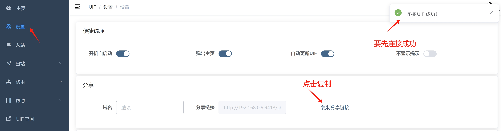
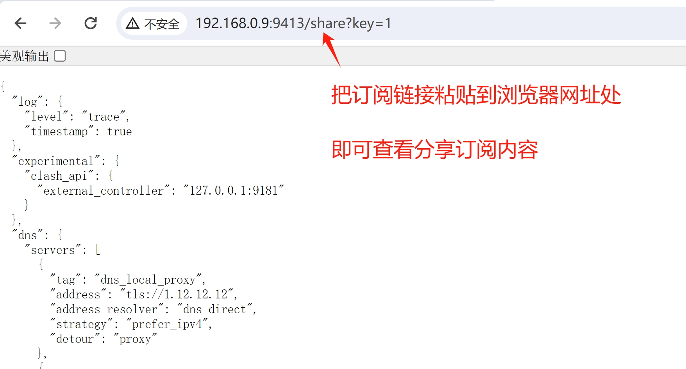

import Tabs from '@theme/Tabs';
import TabItem from '@theme/TabItem';
import MyVideoUrl from '../quic/mobile.mp4';
import ReactPlayer from 'react-player'

# 订阅转换

** 本文 4K 高清视频已上传到 [Youtube](https://www.youtube.com/watch?v=J4IFKoUUGWM&t=5s)**

<ReactPlayer controls url={MyVideoUrl}  width="100%" height="100%" />

---

UIF 可以将 Clash、V2rayN、[Clash-Meta](https://github.com/MetaCubeX/mihomo/tree/Meta)、[V2ray](https://github.com/v2fly/v2ray-core)、Xray 转换成 [Sing-Box](https://github.com/SagerNet/sing-box) 格式；并且提供在线订阅分享的功能，用户可以通过一条**带有密码的订阅链接**就可以把节点信息分享到其他设备上使用，方便简洁而且无需担心节点泄露等安全问题。

使用 [Sing-Box](https://github.com/SagerNet/sing-box) 格式有很多好处，比如说全平台支持，而且在 IOS 上是完全免费的，无需再购买小火箭。

想要使用订阅转换功能，你得首先确保同时安装了 [移动端](../quic/mobile.md) 和 [电脑端](../quic/intro.md)。

## 1 电脑端添加需要转换的订阅

当然前提是你已经有可用的订阅链接了，不然无法转换。

去到 [我的订阅](https://uiforfreedom.github.io/#/out/subscribe)，添加订阅（你的机场订阅等节点信息）。点击启用你想要分享的节点，或者直接全部启用也可以。

在电脑上打开 [设置页面](https://uiforfreedom.github.io/#/settings/uif)，点击 `复制分享链接`；此时 `订阅链接` 已经生成好了：

然后粘贴到本地浏览器，网页打开后你会看到`订阅内容`。如果打不开，请确保电脑的防火墙放行了对应端口。

## 2 设置密码

想要分享订阅，必须设置密码。

在 UIF 的目录下，添加一个名为 `uif_api_address.txt` 的文本文件。往里面写入 `0.0.0.0:9413` （意味着公网开放，9413 是端口，你可以随意修改）后保存。

如无意外，UIF 的目录下会有一个名叫 `uif_key.txt` 的文件，即密码。需要复制这个密码，然后去到 [UIF 首页](http://ui4freedom.org/#/home)，点击 `接口管理`，把密码粘贴进去。

## 3 分享到移动端

最后成功连接后，`订阅链接` 就生效了。

将`订阅内容`分享到其他地方，有两种方法：

- 分享原始 `share.json` 文件，通过微信、邮箱等方式传送到其他设备上。无需可访问的服务器，但无法一键更新。
- 分享 `订阅链接`，通过。 需要可访问的网络地址，如VPS、开放的内网地址等，可以做到随时一键更新。
