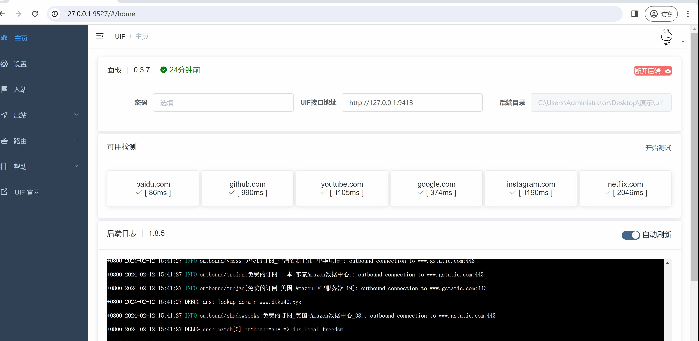
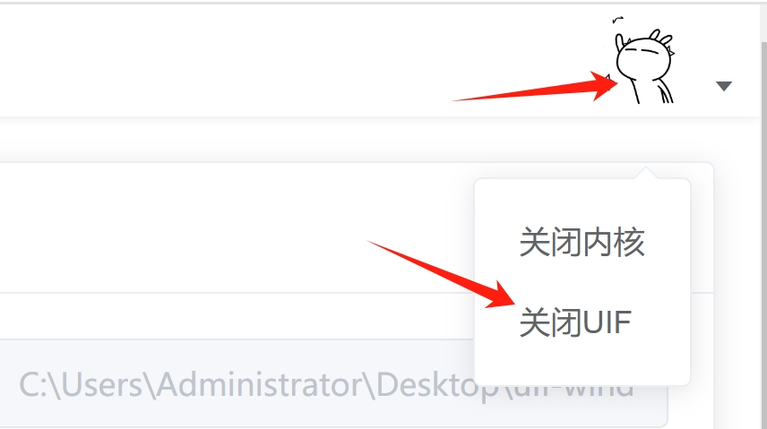

import Tabs from '@theme/Tabs';
import TabItem from '@theme/TabItem';
import ReactPlayer from 'react-player'
import Desktop from './desktop.mp4';

# 电脑端

** 本文 4K 高清视频已上传到 [Youtube](https://www.youtube.com/watch?v=J4IFKoUUGWM&t=5s)**

<ReactPlayer controls url={Desktop}  width="100%" height="100%" />

---

## 添加出站

看到 UIF 的右上角弹出一个 `已成功连接` 的提示框后，你需要添加可用的出站才可实现翻墙。

根据各自情况，选择导入服务器的方法：

<Tabs groupId="operating-systems">
<TabItem value="sub" label="订阅链接（最常见）">

如果你是购买了一些服务（例如说 `机场`等带订阅的服务）；

到 [我的订阅页面](https://uiforfreedom.github.io/#/out/subscribe)，点击 `添加订阅`，`导入方式` 选择 `链接`，填入订阅链接，右上角 `添加`。

</TabItem>

<TabItem value="selfAdd" label="自添加 （爱折腾）">

如果你是自己搭建代理服务器，到 [自添加页面](https://uiforfreedom.github.io/#/out/my)，点击右上角 `添加`，根据你的实际情况添加。

</TabItem>

<TabItem value="meta" label="原始配置 （转移）">

如果你已有代理软件的配置（支持 Clash、 Clash-Meta、V2ray、Xray、Sing-Box）；

到 [我的订阅页面](https://uiforfreedom.github.io/#/out/subscribe)，点击 `添加订阅`，`导入方式` 选择 `原始数据`，填入已有配置，右上角 `添加`。

</TabItem>

</Tabs>

## 启用入站

去到 [入站](https://uiforfreedom.github.io/#/in/my)，点击列表项左侧的 `启用`，UIF 已为你配置好了一些常用的 `入站`，根据实际情况选择如何接管系统的流量：

<Tabs groupId="operating-systems">
<TabItem value="http" label="启用HTTP（最常用）">

如果你是 Windows、Mac 的普通用户，平时只是看看 油管，推特，脸书等，建议你使用 `HTTP 入站` 即可。HTTP 的默认入站配置，会自动修改系统代理，简单快捷。

如果你是 Docker 或者没有图像化界面的 Linux 的用户，你需要手动设置系统代理。

</TabItem>

<TabItem value="tun" label="Tun VPN">

如果你是码农平时需要使用到非 HTTP 协议，或需要在软路由上使用透明代理，启用 `Tun VPN` 可接管系统中的流量。

</TabItem>

</Tabs>

## 关闭

如需关闭，请点击右上角图标，选择`关闭 UIF` 即可关闭内核和 UIF 进程，也就是网页面板不能再打开，如需再次运行，必须要重新双击运行 `uif.exe`。

选择`关闭内核`，UIF 还会在运行，但是不会接管任何流量，也就翻不了墙。你可以再次打开网页面板，然后重新启用入站即可恢复运行内核。

## 更新

建议去到 [设置](https://ui4freedom.org/#/settings/uif)，启用 `自动更新 UIF`即可；每次启动，UIF 会自动检查下载最新版本，全程无需干预。
